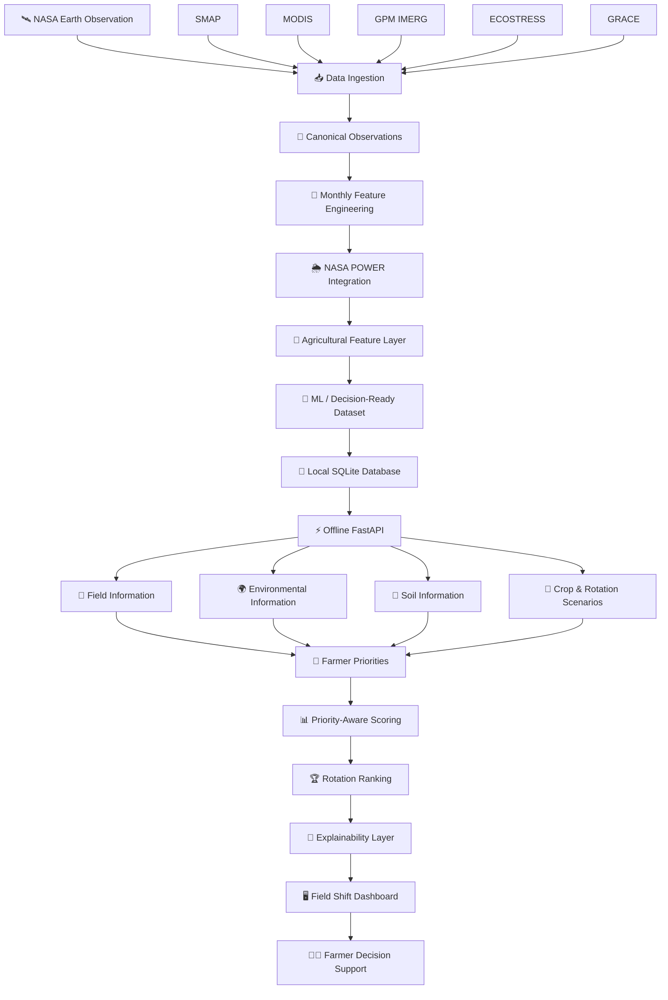
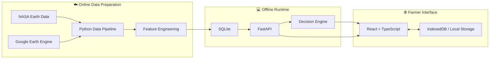
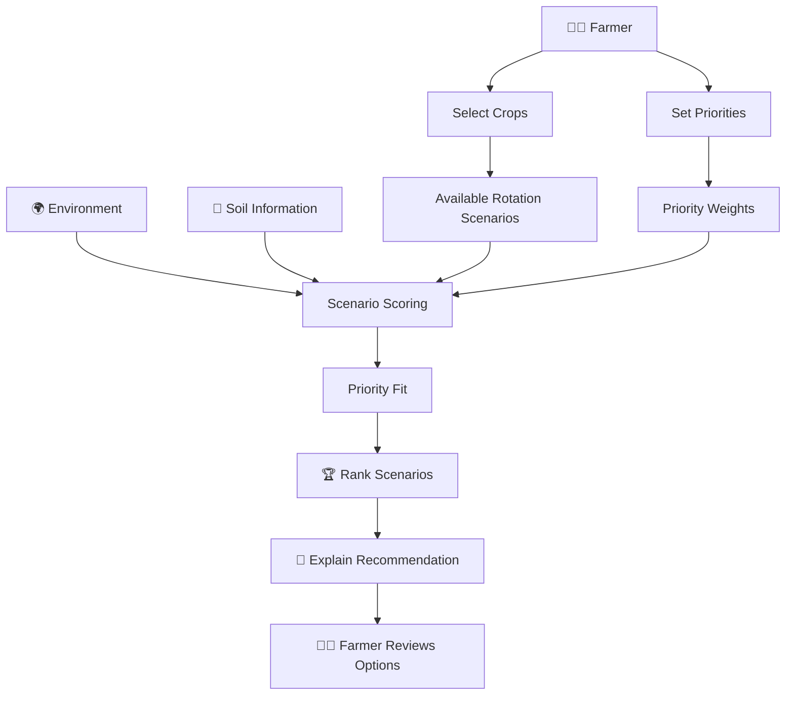
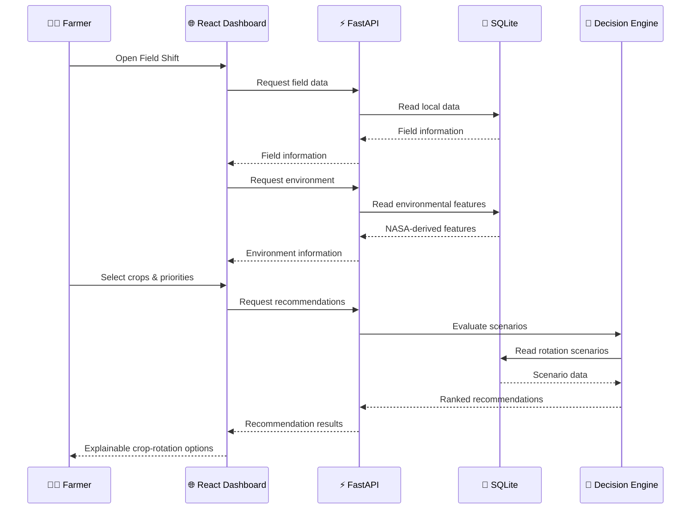
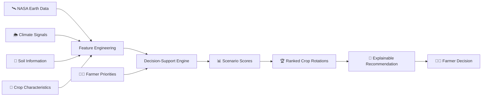

# 🌱 Field Shift

### NASA Space Apps Challenge 2026 — Adapting Farms with NASA Data

> **Real Earth data. Real farm decisions. A more resilient future.**


Field Shift is an **offline-first NASA Earth-observation decision-support system for climate-resilient crop rotation**.

It translates complex Earth-observation and agricultural signals into one plain-language question for farmers facing shifting rainfall, water stress, climate variability, and soil-health challenges:

> **Should I keep this crop, adjust my priorities, or shift my rotation?**

---

## 🛰️ NASA Space Apps Challenge 2026

**Challenge:** Adapting Farms with NASA Data

**Project:** Field Shift

**Focus Areas:**

- 🌍 Earth Observation
- 🌾 Climate-Resilient Agriculture
- 💧 Water Conservation
- 🌱 Soil Health
- ☀️ Climate Resilience
- 🤖 Machine Learning
- 📊 Decision Support
- 📱 Offline-First Technology

---

## 🎯 The Idea

Farmers experience changing weather and field conditions long before those changes become easy to interpret from scientific datasets.

NASA already provides valuable Earth observations for:

- soil moisture
- vegetation condition
- precipitation
- land-surface temperature
- land-water storage
- environmental variability

The challenge is not simply collecting the data.

The challenge is **translating those signals into understandable agricultural decisions**.

Field Shift is designed to combine:

```text
NASA Earth observations
        +
Local field information
        +
Soil information
        +
Crop characteristics
        +
Farmer priorities
        ↓
Understandable field assessment
        +
Crop-rotation decision support
```

The system does not attempt to replace agronomists or make guaranteed yield predictions.

Instead, it helps farmers compare crop-rotation scenarios using transparent, priority-aware decision scores.

---

## 🌾 What Field Shift Does

Field Shift connects Earth observation data with farmer-centered decision support.

The system can:

- 🛰️ Process NASA Earth-observation datasets
- 🌧️ Analyze rainfall and precipitation signals
- 💧 Analyze root-zone soil moisture
- 🌿 Monitor vegetation-condition indicators
- 🌡️ Examine land-surface temperature
- 🌍 Incorporate land-water-storage signals
- 🌱 Incorporate soil information
- 🌾 Compare crop-rotation scenarios
- 🎯 Allow farmers to define their priorities
- 📊 Rank rotation scenarios
- 🔎 Explain why a recommendation received its score
- 📴 Run the farmer-facing decision layer offline
- 🌐 Separate online data preparation from offline decision support

---

## 🏗️ System Architecture

Field Shift is intentionally divided into two major phases.

### ☁️ Phase 1 — Online Data Preparation

NASA Earth data and Google Earth Engine are used during the data-preparation stage.

```text
NASA Earth Data / Google Earth Engine
                │
                ├──────── SMAP
                │
                ├──────── MODIS
                │
                ├──────── GPM IMERG
                │
                ├──────── ECOSTRESS
                │
                └──────── GRACE
                │
                ▼
        Data Ingestion Layer
                │
                ▼
      Canonical Observations
                │
                ▼
        Monthly Features
                │
                ▼
   Agricultural Feature Layer
                │
                ├──────── NASA POWER
                │
                ├──────── Soil Data
                │
                └──────── Crop Data
                │
                ▼
       ML / Decision Dataset
```

### 📴 Phase 2 — Offline Decision Support

After data preparation, the farmer-facing decision layer can operate using a local database.

```text
              Prepared Dataset
                     │
                     ▼
              Local SQLite DB
                     │
                     ▼
                  FastAPI
                     │
          ┌──────────┴──────────┐
          │                     │
          ▼                     ▼
      Field Data          Recommendations
          │                     │
          │                     │
          └──────────┬──────────┘
                     ▼
             Field Shift Engine
                     │
                     ▼
             Farmer Priorities
                     │
                     ▼
          Crop Rotation Ranking
                     │
                     ▼
           Explainable Results
                     │
                     ▼
          Farmer Web Dashboard
```

---

## 🔄 Complete System Workflow

The complete Field Shift workflow, from NASA Earth observation to farmer decision support:



---

## 🧩 High-Level Architecture



---

## 🛰️ NASA Earth-Observation Data

The current ingestion pipeline has processed the following NASA datasets:

| Dataset | Signal | Current Status |
|---|---|---|
| SMAP | Root-zone soil moisture | ✅ Ingested |
| MODIS | NDVI / vegetation condition | ✅ Ingested |
| GPM IMERG | Precipitation | ✅ Ingested |
| ECOSTRESS | Land-surface temperature / thermal condition | ✅ Ingested |
| GRACE | Land-water-storage signal | ✅ Ingested |
| NASA POWER | Climate/weather variables | 🔄 Feature pipeline |

### Primary datasets

#### SMAP

**Signal:** Root-zone soil moisture

Used to provide information about water availability in the soil profile.

Dataset: `NASA/SMAP/SPL4SMGP/007`

#### MODIS

**Signal:** NDVI / vegetation condition

Used as a vegetation-condition indicator.

Dataset: `MODIS/061/MOD13Q1`

#### GPM IMERG

**Signal:** Precipitation

Used to characterize rainfall conditions.

#### ECOSTRESS

**Signal:** Land-surface temperature

Used to provide thermal-condition information and support environmental stress analysis.

#### GRACE

**Signal:** Land-water-storage variation

Used as a broader water-storage indicator.

Dataset: `NASA/GRACE/MASS_GRIDS_V04/LAND`

#### NASA POWER

NASA POWER is used in the broader feature-engineering pipeline for climate and weather variables.

Current parameters include:

```text
ALLSKY_SFC_SW_DWN
T2M
WS10M
T2M_MAX
T2M_MIN
```

---

## 📊 Data Pipeline

The data pipeline is designed around the following stages:

```text
NASA / GEE
    │
    ▼
Raw Earth Observation Data
    │
    ▼
Data Validation
    │
    ▼
Canonical Observations
    │
    ▼
Monthly Aggregation
    │
    ▼
NASA POWER Integration
    │
    ▼
Environmental Features
    │
    ▼
Agricultural Features
    │
    ▼
Crop / Soil Features
    │
    ▼
Scenario Generation
    │
    ▼
Decision / ML Dataset
```

Current pipeline structure:

```text
data-pipeline/
├── dags/
├── historical/
│   ├── ecostress/
│   ├── gpm/
│   ├── grace/
│   ├── modis/
│   └── smap/
│
├── output/
│   ├── canonical/
│   ├── crop/
│   ├── features/
│   ├── scenarios/
│   ├── soil/
│   └── validation/
│
├── scoring/
├── fetch_nasa_power.py
├── ingest_ecostress.py
├── ingest_gpm_rainfall.py
├── ingest_grace_fo.py
├── ingest_modis_ndvi.py
└── ingest_smap.py
```

---

## 🎯 Farmer-Priority Recommendation Engine

Field Shift allows the farmer to define the importance of different decision objectives.

### Current priorities

- 💧 Water Conservation
- 🌱 Soil Health
- ☀️ Climate Resilience
- 🌾 Crop Diversity

The priority system allows the same rotation to receive a different ranking depending on the farmer's current priorities.

For each rotation:

```text
Priority Contribution = Factor Score × Farmer Weight
```

The final decision-support score is:

```text
Priority Fit = Water Contribution
             + Soil Contribution
             + Climate Contribution
             + Diversity Contribution
```

For example:

```text
Water     rotation score × current weight  →  contribution
Soil      rotation score × current weight  →  contribution
Climate   rotation score × current weight  →  contribution
Diversity rotation score × current weight  →  contribution
```

The frontend displays these contributions so the farmer can understand why a particular rotation ranked highly.

---

## 🔎 Explainability

Field Shift is designed to avoid presenting a recommendation as a black box.

Each recommendation can expose:

```text
Rotation
   ↓
Water score
   ↓
Soil score
   ↓
Climate score
   ↓
Diversity score
   ↓
Farmer priority weights
   ↓
Priority Fit
```

The interface is designed to answer:

> **Why was this crop rotation recommended?**

rather than only:

> *What was recommended?*

---

## 🌾 Crop Rotation Decision Flow



---

## 🧠 Machine Learning Layer

The project contains model modules for future / ongoing machine-learning integration:

```text
ml-models/
├── stress_risk_model.py
├── shift_score_model.py
└── yield_forecast_lstm.py
```

### Current model roles

| Model | Intended Role |
|---|---|
| Stress Risk Model | Environmental / field stress assessment |
| Shift Score Model | Crop-rotation / environmental shift scoring |
| Yield Forecast LSTM | Temporal yield forecasting |

The complete ML integration is not yet the sole production runtime path.

The current farmer-facing decision layer primarily uses the prepared local dataset and explainable priority-aware scoring system.

This distinction is intentional: a decision-support score should not be presented as a scientifically validated yield or profit prediction unless appropriate validation has been completed.

---

## 💻 Technology Stack

### Frontend

- React
- TypeScript
- Vite
- Tailwind CSS
- Responsive farmer-first UI
- Bangla / English interface
- IndexedDB
- Local Storage
- Offline-first frontend architecture

### Backend

- Python
- FastAPI
- SQLite
- REST API
- Offline runtime
- Local decision-support services

### Data & Earth Observation

- NASA SMAP
- NASA MODIS
- NASA GPM IMERG
- NASA ECOSTRESS
- NASA GRACE
- NASA POWER
- Google Earth Engine
- Python data-processing pipeline

### Machine Learning

- scikit-learn
- PyTorch
- XGBoost-compatible modeling workflow
- LSTM-based temporal forecasting
- Feature engineering
- Temporal validation workflow

### Development & Deployment

- Git
- GitHub
- Vite
- FastAPI
- SQLite
- PWA / Service Worker roadmap
- IndexedDB
- Local browser caching

---

## 🧰 Tech Stack Overview

```text
┌──────────────────────────────────────────────────────┐
│                   FIELD SHIFT                        │
├──────────────────────────────────────────────────────┤
│                                                      │
│  🌐 FRONTEND                                         │
│  React + TypeScript + Vite + Tailwind CSS            │
│                                                      │
├──────────────────────────────────────────────────────┤
│                                                      │
│  ⚡ BACKEND                                          │
│  Python + FastAPI + SQLite                           │
│                                                      │
├──────────────────────────────────────────────────────┤
│                                                      │
│  🛰️ EARTH OBSERVATION                                │
│  NASA + Google Earth Engine                          │
│                                                      │
│  SMAP | MODIS | GPM | ECOSTRESS | GRACE | POWER      │
│                                                      │
├──────────────────────────────────────────────────────┤
│                                                      │
│  🤖 MACHINE LEARNING                                 │
│  scikit-learn + PyTorch + XGBoost workflow           │
│                                                      │
├──────────────────────────────────────────────────────┤
│                                                      │
│  💾 OFFLINE                                          │
│  SQLite + IndexedDB + Local Storage                  │
│                                                      │
└──────────────────────────────────────────────────────┘
```

---

## 🖥️ Frontend

The farmer-facing application is located in `frontend-web/`.

Current frontend capabilities include:

- Field overview
- Environmental information
- Soil information
- Farmer priority selection
- Crop selection
- Crop-rotation recommendations
- Recommendation ranking
- Rotation-specific factor scores
- Priority-weight calculation
- Priority Fit calculation
- Recommendation explanation
- API/offline status handling
- Loading states
- Error handling
- Local storage architecture
- Bangla / English interface
- Farmer-oriented visual dashboard

### 📁 Frontend Architecture

```text
frontend-web/
│
├── public/
│
├── src/
│   │
│   ├── assets/
│   │
│   ├── components/
│   │   ├── common/
│   │   ├── farmer/
│   │   └── technical/
│   │
│   ├── engine/
│   │   ├── explainabilityEngine.ts
│   │   ├── priority.ts
│   │   ├── priorityEngine.ts
│   │   ├── recommendationEngine.ts
│   │   └── riskEngine.ts
│   │
│   ├── pages/
│   │   └── Dashboard.tsx
│   │
│   ├── services/
│   │   └── api.ts
│   │
│   ├── storage/
│   │   ├── cache.ts
│   │   ├── indexedDb.ts
│   │   └── sync.ts
│   │
│   └── types/
│
├── package.json
├── vite.config.ts
└── ...
```

---

## 📴 Offline-First Architecture

Offline operation is one of the core design principles of Field Shift.

The system separates:

**Online**

```text
NASA / GEE
    ↓
Data preparation
    ↓
Feature engineering
    ↓
Prepared dataset
    ↓
Local database
```

from:

**Offline**

```text
Local SQLite
    ↓
FastAPI
    ↓
Decision engine
    ↓
Frontend
    ↓
Farmer
```

This means the farmer-facing decision layer does not need to continuously query NASA or Google Earth Engine.

### 💾 Offline Runtime

The current offline runtime is located at:

```text
backend/offline/server.py
backend/offline/field_shift.db
```

The FastAPI offline service currently exposes:

```text
GET  /api/offline/health

GET  /api/offline/fields/{field_id}

GET  /api/offline/fields/{field_id}/environment

GET  /api/offline/fields/{field_id}/soil

GET  /api/offline/crops

GET  /api/offline/fields/{field_id}/rotations

GET  /api/offline/fields/{field_id}/rotations/evaluated

POST /api/offline/fields/{field_id}/recommendations
```

---

## 🚀 Run the Backend

From the project root:

**Windows PowerShell**

```powershell
.\backend\venv\Scripts\python.exe -m uvicorn offline.server:app --app-dir backend --host 127.0.0.1 --port 8001
```

Or, if your virtual environment is activated:

```bash
python -m uvicorn offline.server:app --app-dir backend --host 127.0.0.1 --port 8001
```

The backend will run at:

```text
http://127.0.0.1:8001
```

Health endpoint:

```text
http://127.0.0.1:8001/api/offline/health
```

---

## 🌐 Run the Frontend

Open another terminal:

```bash
cd frontend-web
npm install
npm run dev
```

The Vite development server will normally run at:

```text
http://localhost:5173
```

The frontend expects the offline API at `http://127.0.0.1:8001`. This can be changed using the `VITE_API_BASE_URL` environment variable.

Example:

```env
VITE_API_BASE_URL=http://127.0.0.1:8001
```

---

## 🔗 API → Frontend Flow



---

## 📱 Farmer-Facing Experience

The redesigned interface follows a progressive-disclosure approach.

### 1. Field Overview

```text
🌾 Field
🌡️ Temperature
🌧️ Rainfall
💧 Water status
🌱 Soil status
☀️ Climate status
```

### 2. Rotation Lab

Farmers can compare crop sequences using real crop imagery and scenario information.

```text
Year 1  →  🌾 Aman Rice
Year 2  →  🌱 Mungbean
Year 3  →  🌼 Mustard
```

### 3. Farmer Priorities

```text
💧 Water conservation
🌱 Soil health
☀️ Climate resilience
🌾 Crop diversity
```

### 4. Recommendation

```text
🥇 Top recommendation

Aman Rice → Mungbean

Priority Fit: XX%

Why?

Water      XX
Soil       XX
Climate    XX
Diversity  XX
```

---

## 🛰️ Earth Observation Context

The dashboard can surface environmental information derived from the prepared dataset.

Examples include:

- 🌧️ GPM precipitation
- 💧 SMAP root-zone soil moisture
- 🌿 MODIS NDVI
- 🌡️ ECOSTRESS land-surface temperature
- 🌍 GRACE water-storage anomaly
- ☀️ NASA POWER climate variables

The purpose is to make scientific observations understandable without forcing farmers to interpret raw satellite datasets.

---

## 🌱 Soil Information

Field Shift incorporates soil information into the decision-support workflow.

Where soil values originate from modelled background datasets, the interface should clearly label them as modelled estimates rather than field measurements.

This distinction is important for scientific transparency.

Example:

```text
Soil Information

pH                5.48
Organic Carbon    XX
Clay              XX%

Source: SoilGrids modelled estimate
```

---

## 📊 Scientific Scoring Principles

Field Shift is designed around transparent scoring rather than unexplained black-box recommendations.

All decision-support indicators should be transformed into documented comparable scales before being combined.

Conceptually:

```text
Raw environmental signal
        ↓
Quality / validity checks
        ↓
Transformation / normalization
        ↓
0–1 decision indicator
        ↓
Farmer priority weight
        ↓
Weighted contribution
        ↓
Final Priority Fit
```

A normalized value in the scoring system represents a decision-support suitability contribution.

It should not automatically be interpreted as:

- probability
- percentage chance
- predicted yield
- guaranteed profit
- causal effect

---

## 🧪 Validation Philosophy

The project aims to evaluate machine-learning components using time-aware validation rather than randomly mixing future observations into training data.

A planned temporal structure is:

```text
2019–2022  →  Training
2023       →  Validation
2024       →  Test
```

Example reporting format:

| Model | Metric | Result |
|---|---|---|
| Stress Risk | F1 | TBD |
| Stress Risk | ROC-AUC | TBD |
| Shift Score | MAE | TBD |
| Yield Forecast | RMSE | TBD |
| Yield Forecast | R² | TBD |

Metrics should only be published after the corresponding models have been evaluated.

**No fabricated model-performance numbers should be presented as results.**

---

## 🇧🇩 Feni District Use Case

The current project is being developed around a Feni District, Bangladesh use case.

The broader research and data pipeline is designed to combine:

```text
NASA Earth observations
        +
Climate variables
        +
Soil information
        +
Crop information
        +
Agricultural targets
        +
Local field context
        ↓
Crop-rotation decision support
```

The goal is to demonstrate how Earth observation can be translated into locally understandable agricultural decision support.

---

## 🗂️ Project Structure

```text
field-shift/
│
├── backend/
│   ├── app/
│   ├── offline/
│   │   ├── field_shift.db
│   │   ├── server.py
│   │   └── README.md
│   │
│   ├── tests/
│   ├── Dockerfile
│   └── requirements.txt
│
├── data-pipeline/
│   ├── dags/
│   ├── historical/
│   ├── output/
│   │   ├── canonical/
│   │   ├── crop/
│   │   ├── features/
│   │   ├── scenarios/
│   │   ├── soil/
│   │   └── validation/
│   │
│   ├── scoring/
│   ├── fetch_nasa_power.py
│   ├── ingest_ecostress.py
│   ├── ingest_gpm_rainfall.py
│   ├── ingest_grace_fo.py
│   ├── ingest_modis_ndvi.py
│   └── ingest_smap.py
│
├── frontend-web/
│   ├── public/
│   ├── src/
│   │   ├── assets/
│   │   ├── components/
│   │   ├── engine/
│   │   ├── i18n/
│   │   ├── pages/
│   │   ├── services/
│   │   ├── storage/
│   │   └── types/
│   │
│   ├── package.json
│   └── vite.config.ts
│
├── ml-models/
│   ├── stress_risk_model.py
│   ├── shift_score_model.py
│   └── yield_forecast_lstm.py
│
├── docs/
│   ├── data-sources.md
│   └── demo.gif
│
├── LICENSE
└── README.md
```

---

## 📈 Current Implementation Status

### 🛰️ NASA / Earth Observation

- [x] NASA / GEE ingestion workflow
- [x] SMAP ingestion
- [x] MODIS ingestion
- [x] GPM IMERG ingestion
- [x] ECOSTRESS ingestion
- [x] GRACE ingestion
- [x] Current dataset validation
- [x] Canonical observation workflow
- [ ] Environmental feature pipeline
- [ ] Final ML-ready dataset refinement

### 💾 Offline Runtime

- [x] Local SQLite database
- [x] FastAPI offline service
- [x] Health endpoint
- [x] Field endpoint
- [x] Environment endpoint
- [x] Soil endpoint
- [x] Crop endpoint
- [x] Rotation endpoint
- [x] Evaluated-rotation endpoint
- [x] Farmer-priority recommendation endpoint

### 🌐 Frontend

- [x] React dashboard foundation
- [x] Farmer priority selector
- [x] Crop selection
- [x] Recommendation ranking
- [x] Rotation-specific scoring
- [x] Priority-weight calculation
- [x] Priority Fit calculation
- [x] Recommendation explanation
- [x] API integration
- [x] Loading states
- [x] Error handling
- [x] Local storage architecture
- [x] Bangla / English interface
- [x] Farmer-first visual redesign
- [ ] Final production PWA workflow

### 🤖 Machine Learning

- [x] Model module structure
- [ ] Stress-risk model workflow
- [ ] Shift-score model workflow
- [ ] Yield-forecast model workflow
- [ ] Complete end-to-end ML integration
- [ ] Final temporal validation
- [ ] Final model-performance reporting

---

## 🧭 Development Roadmap

### Phase 1 — Earth Observation

- [x] NASA data ingestion
- [x] GEE processing
- [x] Historical environmental data
- [x] Data validation

### Phase 2 — Feature Engineering

- [x] Canonical observations
- [ ] Monthly aggregation
- [ ] NASA POWER integration
- [ ] Environmental features
- [ ] Final agricultural target integration
- [ ] Final ML-ready dataset

### Phase 3 — Decision Engine

- [x] Crop scenarios
- [x] Farmer priorities
- [x] Weighted scoring
- [x] Recommendation ranking
- [x] Explainability
- [ ] Extended uncertainty representation

### Phase 4 — Farmer Interface

- [x] React dashboard
- [x] Field overview
- [x] Environment overview
- [x] Soil information
- [x] Crop selection
- [x] Recommendation cards
- [x] Priority controls
- [x] Bangla / English interface
- [ ] Final PWA / service-worker implementation

### Phase 5 — Validation & Demonstration

- [ ] Final model validation
- [ ] Scientific validation tables
- [ ] End-to-end demo
- [ ] Demo GIF
- [ ] Final documentation
- [ ] Final Space Apps presentation

---

## 🎬 Demo

The final repository should include a short end-to-end demonstration.

Planned location: `docs/demo.gif`

Intended flow:

```text
Open Field Shift
      ↓
Select field
      ↓
Review field conditions
      ↓
Choose crops
      ↓
Set farmer priorities
      ↓
Generate recommendations
      ↓
Compare Priority Fit
      ↓
Understand why the ranking changed
```

---

## 🔬 Data Sources & Credits

Field Shift uses public NASA Earth-observation products and Google Earth Engine during the online data-preparation stage.

Primary sources include:

- **SMAP** — Soil Moisture Active Passive
- **MODIS** — Moderate Resolution Imaging Spectroradiometer
- **GPM IMERG** — Global Precipitation Measurement / Integrated Multi-satellitE Retrievals
- **ECOSTRESS** — ECOsystem Spaceborne Thermal Radiometer Experiment on Space Station
- **GRACE** — Gravity Recovery and Climate Experiment
- **NASA POWER** — Prediction Of Worldwide Energy Resources

Additional soil and agricultural datasets may be incorporated as required by the research and feature-engineering pipeline.

Detailed dataset identifiers, processing methods, transformations, and citations should be documented in `docs/data-sources.md`.

---

## ⚠️ Scientific & Decision-Support Disclaimer

Field Shift is a decision-support system.

It is **not**:

- a replacement for an agronomist
- a replacement for local agricultural extension services
- a guaranteed crop-yield predictor
- a guaranteed profit predictor
- a guaranteed irrigation-cost predictor
- a guarantee of farm performance

The recommendation score is intended to help farmers compare available crop-rotation scenarios according to environmental information and their stated priorities.

All recommendations should be interpreted together with:

- local field observations
- farmer experience
- local weather conditions
- soil testing where available
- agronomic advice
- crop-market conditions
- seasonal constraints

---

## 🔐 Offline-First Principle

A key design principle of Field Shift is:

> **Prepare complex Earth-observation data online, but keep the farmer-facing decision layer simple and locally available.**

```text
Complex scientific data
        ↓
Prepared before deployment
        ↓
Local database
        ↓
Offline decision support
        ↓
Simple farmer interface
```

This architecture is intended to make the decision layer more resilient in environments where continuous internet connectivity cannot be assumed.

---

## 🌍 Why This Matters

Climate variability is making agricultural planning increasingly difficult.

Farmers need information that is:

```text
Accurate enough
      +
Understandable
      +
Context-aware
      +
Explainable
      +
Available locally
```

Field Shift attempts to bridge the gap between:

```text
Satellite / Earth Observation Data
                │
                ▼
         Scientific Signals
                │
                ▼
       Agricultural Features
                │
                ▼
        Decision Intelligence
                │
                ▼
          Farmer Priorities
                │
                ▼
        Practical Crop Options
```

The goal is not to overwhelm farmers with satellite data.

The goal is to translate that data into better-informed choices.

---

## 🌱 Project Principles

Field Shift follows five principles:

1. **Explainable** — Farmers should understand why a scenario was ranked.
2. **Transparent** — The system should make data sources and scoring logic visible.
3. **Data-Driven** — Recommendations should be grounded in prepared environmental and agricultural data.
4. **Priority-Aware** — Different farmers may have different objectives.
5. **Honest About Uncertainty** — A decision-support score is not a guarantee.

---

## 🛰️ From Earth Observation to Farm Decision



---

## 🏆 NASA Space Apps Challenge 2026

Built for: **NASA Space Apps Challenge 2026**

Project: **Field Shift — Adapting Farms with NASA Data**

---

## 👥 Team

Field Shift is being developed as a research and engineering project focused on:

- Earth observation
- agricultural intelligence
- machine learning
- climate resilience
- offline-first systems
- farmer-centered decision support

---

## 📄 License

Built for NASA Space Apps Challenge 2026.

See [LICENSE](LICENSE) for the applicable terms.

---

## 🌾 Final Message

> **Real Earth data. Real farm decisions. A more resilient future.**

**Field Shift** — Turning NASA Earth observations into understandable agricultural decisions.
